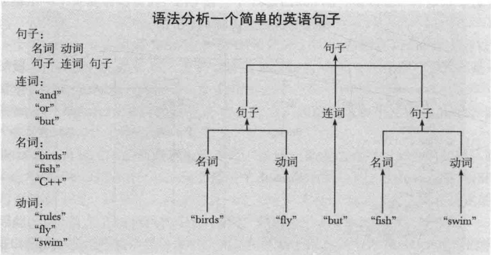

# CH02 编写一个程序

- P132（中文版PDF）

## 6.1 一个问题

## 6.2 对问题的考虑
- **提出部分解，产生想法和发现错误的历程**，甚至比实现过程中碰到的语言技术细节更重要
- 程序设计的几个阶段：
	- 分析
	- 设计
	- 实现 	

## 6.3 计算器问题
- LeetCode有相关+-\*/小括号混合运算的题目，挺困难的。有一种思路写出的代码比较精简，每当遇见左括号，递归计算括号内的值。  且看看书中如何演绎
- 直接跳到6.3.2

### 6.3.2 单词
- **单词**是表示可以看作一个单元的一个字符序列。例如数字或者运算符，这也是C++编译器处理源代码的方法。，实际在某种形式上是文本分析经常采用的方法。
- 对于计算器，每个单词可以表示为(kind, value)，kind表示单词是一个数字，运算符还是括号，value是其对应的数值。

### 6.3.3 实现单词
- 可以直接使用pair
- 将表达式转换为Token（单词）

### 6.3.4 使用单词
- 从cin中读入单词，并把结果保存在vector中。
- 难点又出现了，我们虽然保存了表达式，可是该怎么计算呢？从左到右，从右到左？都不对，括号怎么解决呢？此时，**我们必须后退一步**，停止程序的编写，重新考虑如何读取和分析输入表达式，并计算它的值。

### 6.3.5 重新开始

- 问题6，是个不小的坑。书中7.8节，给出了相关实现。
- 在程序设计早期避免**“功能蔓延”**很重要，应该保证先构建一个简单的版本，只实现最基本的功能。分阶段实现比一次完成要简单的多。
- 记住，当面对一个**棘手的技术问题**时，通常都有一个标准答案。咨询同事，查阅文献。

## 6.4 文法
- **文法**来定义表达式的语法，然后再程序中实现这些文法规则。

- 从最初的伪代码到现在使用单词和文法的方法，概念上是一个巨大的飞跃。**需要依靠帮助**：前人的经验，参考文献和导师的指导。
- 如何读入一个文法呢？基本方法是这样的：对于给定输入，从顶层规则Expression开始，搜索与输入单词匹配的规则。根据文法读取单词流的方式称为**语法分析**。实现该功能的程序称为**分析器或者语法分析器**。
文字版
- 复杂的文法并不适合人们阅读，但计算机却擅长这类工作。

### 6.4.1 英文文法
- 我们来看一下很小的英文文法子集：

### 6.4.2 设计一个文法
- 如何设计出这些表达式的文法规则？经验。

- 一些人习惯称单词为终结符，称规则为非终结符或产生式。

## 6.5 将文法转换为程序
- 实现一个文法的程序通常被称为分析器。

### 6.5.1 实现文法规则

### 6.5.2 表达式
- 我们先编写expression(),文法规则如下：

- 第一次尝试将一组文法规则转换为代码，将会经历一些不成功的开始。这是学习一种新技术常见的过程，我们可以从中学到很多有用的东西。特别地，通过观察相似代码段表现出令人吃惊的不同行为，初学者可以学到很多。**阅读代码是积累编程技巧的有效途径**。

- 逻辑看起来没问题，但是存在一个很大的问题，怎么才能知道一个表达式的结尾？事实上这个函数只能执行到第一行代码，不停的调用自己-无限递归

- 第二次尝试，

- 这个函数可以或多或少的运行，注意1-2-3上边函数执行的是1-(2-3)结果是2，但是正确结果是-4.
- **出错了，要问我们做错了什么？ 而且我们必须理解代码在做什么，必须能解释它为什么对有些表达式计算正确，而有些错误**
- **错误分析**通常也是找到正确求解方案的最好方法。
- 上边函数，先读入一个Term，接着判断它后面是否有一个+或-，若有则寻找一个Expression。实际上这实现了一个略微不同的文法。

- 第三次尝试

- 对+或-进行了两次判断。优化

- 我们所作的是用循环代替了expression对自身的调用。

### 6.5.3 项
- Term的文法和Expresssion非常相似。

- 代码如下：

- 注意C++对浮点数没有定义模运算。我们可以在运行时检查运算符的两个运算数是否为整数，不是给出错误信息；或者简单的将操作符%排除在外，暂时这种方法。可以随时将%加进来，参考7.5节
- 还存在一个不可接受的情况。除数不能为0.

### 6.5.4 基本表达式
- 实现代码比较混乱，因为其中有很多可能导致语法错误的地方

## 6.6 实验第一个版本
- 上边的并不能够很好运行。 因为程序“吃掉”了一些输入而没有让它们参加运算。看一下expression函数，如果token不是+或-，我们就返回了，并没有把它保存下来用于后边的计算。
- 所以，我们需要一个专门用于单词处理的输入流，能够将已经读出的单词重新放回去。

## 6.7 实验第二个版本
- 程序得到了正确的结果。但是仍然存在一个单词预读方面的问题。也就是说，一个表达式的结果不是被立即输出，而被推迟到程序读入下一个表达式的第一个单词以后才输出。
- 如何改进？一个明显的方法就是加入一个“输入命令”。
- 好了，现在有一个比较好的计算器程序的初步版本。虽然不是最终的，但是我们可以进一步完善。

## 6.8 单词流
 

### 6.8.1 实现Token_stream
- 为了简单起见，这里规定每次只能放回一个单词。
 
 

### 6.8.2 读单词
 

### 6.8.3 读数值
- **输入流能够解析C++字面常量**，因此我们所要作的只是如何在get函数中告诉cin完成这些工作而已。  请注意，我们如何一次又一次避免做复杂工作，代之以寻找简单的解决方案-通常借助与C++库。这就是程序设计的本质：不断寻找更简单的方法，这与优秀的程序员都是懒惰的不谋而合？。

## 6.9 程序结构
- 不识庐山真面目，只缘身在此山中。**如果我们只关系一个程序中的函数，类等细节，就容器失去对程序的整体把控。**
 
 

P161

- 习题暂略，目前只做了1，2，3