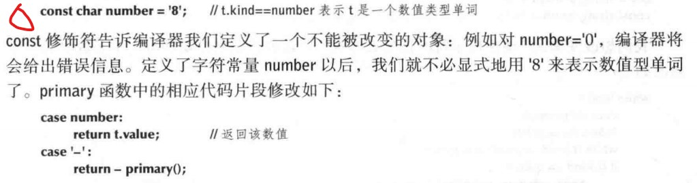
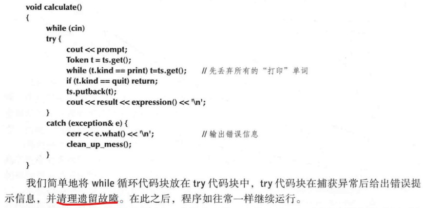
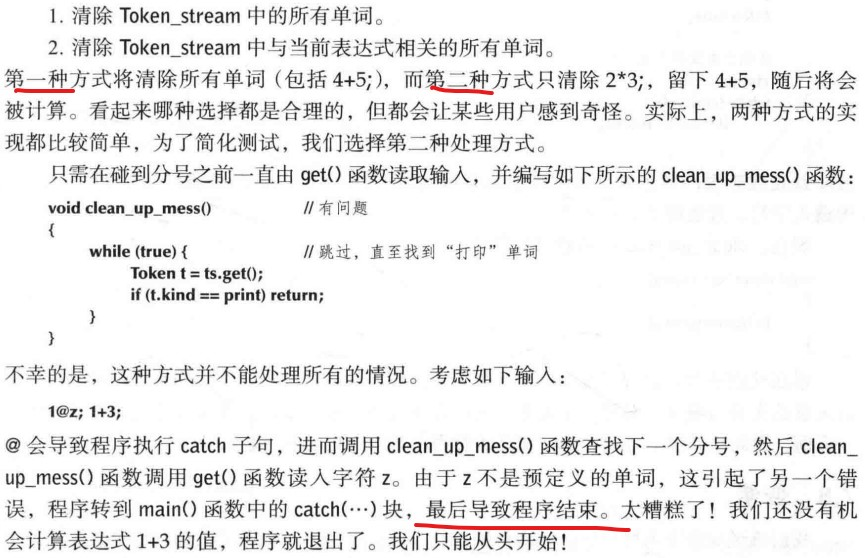
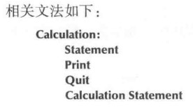
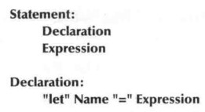
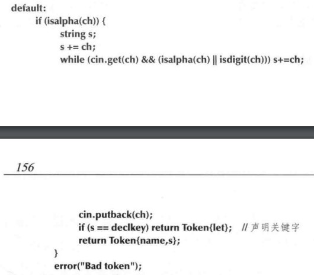

# CH07 完成一个程序

- 编写程序需要不断地改进你要实现地功能及其表达方式。第六章我们给出了一个能够正确运行地计算器程序初步版本，本章将对其进行完善和优化。
- **完善程序**：易于用户使用；方便开发者维护-改进用户接口，添加一些重要地错误处理机制，增加一些有用的功能，重构代码使之易于理解和修改。

## 7.1 简介
- 程序可以初步运行，编程的真正乐趣就开始了。
- 本章引导你，如何以**专业程序员**的角度来优化第六章给出的计算器程序。**注意**，本章中提出的程序相关的问题以及一些思考，远比计算器程序本身有趣的多。

## 7.2 输入和输出

- 修改程序的注意数据结构只是为了获得一点小小的改进，这是**不明智**的。而且我们还没有进行全面的测试，目前我们决定不做输出形式上的改进。

## 7.3 错误处理
- **当你的程序 能够初步运行时，你应该做的第一件事情就是打破它**，也就是给他各种输入，期待它表现出错误的行为。
- 试一试
	- 尝试用不同的问题表达式测试程序，看看它能表现多少种错误。 

- 我没有按照书中用的错误方式，我直接使用的断言。
- 在Unix为代表的OS中，在不改变程序的情况下，令cin从文件而不是键盘输入数据，令输出到cout的内容转到文件，是非常容易的。如果要修改源程序，见CH10
- 我们希望退出前，把结果输出。需要重新审视代码。

## 7.4 处理负数
- 对于本例，沃恩只需要修改文法来处理负号。最简单的方式是修改Primary的定义，将：

- 增加一元运算。

## 7.5 模运算%
- 如何对浮点数模运算？

- 当然也可以转换为整数，禁止浮点数模运算。

## 7.6 清理代码
- 重新检查代码，做适当的清理和简化，并增加一些注释以提高系统的可读性。

### 7.6.1 符号常量
- 我们用字符'8'表示Token中包含一个值，有点奇怪。可以引入一个符号常量。**如果频繁地用注释来解释程序地含义**，通常表面你的代码应该改进了。

- 理论上可以为所有地单词类型设置符号名词，但是太过于繁琐。试着更改'q'和';'

### 7.6.2 使用函数
- 理想情况下，**一个函数只实现一个独立地逻辑功能**（见4.5.1节）
- 分析下main函数
	- 它搭起了程序的整体框架：启动程序，结束程序，处理致命错误
	- 用一个循环来计算表达式。  可以把这部分独立为一个函数。

### 7.6.3  代码布局
- 理想情况下，每个函数的代码都能全部显示在屏幕的可视区域上。
- 我们在程序中用符号常量quit代替字符q，这不仅提高程序的可读性，而且保证我们的编译错误会被编译器捕获。
- 代码清理阶段，我们可能意外地引入一些错误。记住：**及早测试，经常测试**

### 7.6.4 注释
- 好的注释是程序代码地重要组成部分。在程序开发进度很紧时，我们往往会忽略注释。当我们回头来进行代码清理时，是一个很好的时机来全面检查程序的每个部分。

## 7.7 错误恢复
- 为什么程序遇到错误就结束运行呢？可以选择给出错误提示，然后继续运行。

- 清理遗留故障，意味着与错误相关的程序数据都已清理，所有数据都处于良好的，可预测的状态。

- 可以考虑设计一个不抛出异常就能够从Token_stream中清理字符的方法。错误处理通常比较困难。

## 7.8 变量
- 增加变量和常量是对计算器程序的重大扩展，会涉及程序的大部分代码。如果没有充分的理由和时间，最好不要进行这种类型的修改。

### 7.8.1 变量和定义
- 使用变量进行计算，比如pi和e（有点优秀）。
- 把变量存储在var_table中（是一个vector，数据量大需要频繁查找，建议map或者hash），两个函数和变量有关，get_value和set_value

- 下边就是结合文法实现statement和declaration。

### 7.8.2 引入name单词
- 程序还无法识别单词'='，可以在get函数中添加判断。但是对于单词let和name，必须修改get函数来识别单词。
- 此部分特别注意default怎么实现的

### 7.8.3 预定义名字
- define_name来实现预定义名字。

### 7.8.4 我们到达目的地了吗
- 还可以定义更多的操作和变量。如：提供赋值操作符，如果要实现，还要区分变量和常量。