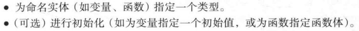

# CH08 函数相关的技术细节

## 8.1 技术细节
- 如何用代码表达思想远比我们用来表达这些思想额程序涉及语言技术细节更有意思。比如，我们更愿意讨论一部好的小说中的思想和它表达这些思想的方式，而不是其中的英语语法和词汇。
- 但，我们**不是总能选择**。刚开始编程，你必须学习它的语法和词汇表。不要忘记：	
	- 我们学习的主要是程序设计
	- 我们生产的是程序和系统
	- 程序设计语言只是工具 

- **记住这几点似乎极其困难。很多程序员对明显是属于编程语言语法和语义次元细节的内容表现出巨大的热情。特别是，很多人有这样一个错误观念：他们使用的第一种编程语言中的工作方法是做任何事的不二法门。请不要掉入这种陷阱**。C++在很多方面是一种非常好的编程语言，但它并不完美和其他编程语言一样。

## 8.2 声明和定义
- 声明语句将名字引入作用域。

- extern关键字几乎没什么用处，不建议用。

### 8.2.1 声明的类别
- 常量，变量，函数，名字空间，类型，模板

### 8.2.2 变量和常量声明
- 常量声明必须进行初始化。

### 8.2.3 默认初始化
- C++不会对内置类型设置默认初始化。特别注意。

## 8.3 头文件
- 实际上，C++语言并不关心文件后缀。但请坚持这个命名习惯。
- 注意不要重复包含头文件。

## 8.4 作用域
- 作用域是一个程序文本区域。

- 作用域的主要作用是保持名字的局部性，使其不影响声明与其他地方的名字。
- 条件表达式可以帮助我们避免冗长的代码。
- **局部性是一种很好的性质**，因此你应该尽量保持名字的局部性。
- 只要可能，你应该避免这种复杂的嵌套和隐藏。记住，“**保持简单性**”。一个名字的作用域越大，名字就应该越长，越具有描述性。在程序中尽量少用全局变量，一个主要原因就是你很难知道哪个函数会修改他们。
- 注意，C++语法结构定义了嵌入的作用域：
	- 类中的函数
	- 类中的成员类，只在复杂类中才有用，记住理想情况是保持类简单，简短。
	- 函数中的类，局部类。应避免这种代码，如果你觉得需要，那么你的函数可能太长了。
	- 函数中的函数， **非法**
	- 函数或其他块中的块。这种嵌套块避免不了，但要对复杂的嵌套保持警惕：它很容易隐藏错误。
	- C++还提供：名字空间，专门表达作用域
	- 注意，我们使用一致的缩进格式来表面嵌套。

## 8.5 函数调用和返回
- 本节关注参数如何指定和传递。

### 8.5.1 声明参数和返回类型
- 可在ISO C++标准中找到函数定义的完整语法。

### 8.5.2 返回一个值
- 如果函数设定返回值，请确保该函数每种执行路径都有一条return语句或者error。
- 由于历史原因，main函数是个特例，默认返回0.

### 8.5.3 传值
- 最简单的就是参数值拷贝传递

### 8.5.4 传常量引用
- 当传递到占用存储空间小的值，如一个整数，双精度值或者一个单词，传值方式简单，直接，高效。但占用存储空间大的值，我们要尽量避免拷贝。
- 常量引用允许生成临时对象的引用

### 8.5.5 传引用
- 本质其实还是指针。

### 8.5.6 传值与传引用的对比
- 注意，常量引用不需要一个左值。

- 这些原则会帮我们写出最简单，最不易出错而且高效的代码。

### 8.5.7 参数检查和转换
- 类型转换一般情况是很有用的，但偶尔会带来奇怪的结果。
- 如果你确实想将一个双精度值截取为一个整数，请使用显示类型转换

### 8.5.8 实现函数调用
 
- expression调用term
 
- term调用primary
 
- primary调用expression
 
- 编译器为expression的这次调用创建了它自己的活动记录。这样left和t在两次调用中是不同的，这是一种很好的处理方式。
 
- 应该是先进后出把。不同C++编译器实现和使用调用栈的细节是不同的。知道“活动记录”，“调用栈”之类的术语。

### 8.5.9 constexpt函数
- 一个constexpr函数和普通函数行为相同，但若在需要一个常量的位置处使用它，则有所不同，此时若传递的参数是常量表达式，则计算在编译时完成，否则输出错误信息。为使该机制可行，要求constexpr函数必须非常简单，C++11中要求其只能包含一条return语句，C++14中还可以写简单的循环。一个constexpr不能有副作用，即它不能改变函数体之外的变量值。
- 足够简单，在C++标准里有详细规则

## 8.6 计算顺序
- 逐语句执行，当执行线程到达一个变量定义时，变量就会被创建，也就是说编译器会为它分配内存空间，并对其初始化。当变量退出其作用域，将会被销毁，原则上它指向的对象被删除。
- 编译器可以优化代码，只要得到的结果和我们目的相符即可。

### 8.6.1 表达式计算
- **表达式中子表达式计算顺序所遵循的规则，是按优化编译器的需求设计的，而不是为了方便程序员。** 有一个简单的原则可以帮你远离麻烦：如果你在表达式中改变一个变量的值，不要在同一个表达式中再读或写这个变量。
 
- 特别注意，赋值符在表达式中只是一种运算符而已，并没有特殊的地位。因此不能保证赋值符左边的子表达式在右子表达式之前计算。

### 8.6.2 全局初始化
 
- 如果确实需要一个全局变量，而且需要对它进行复杂的初始化。**考虑使用函数返回一个静态的局部变量，该变量只在函数首次调用时才被初始化**。effective C++上有更详细介绍。

## 8.7 名字空间
 
- 命名空间+类名 称为全限定名。

### 8.7.1 using声明和using指令
- 将一个using指令放在头文件中是一个非常坏的习惯，因为用户会陷入名字冲突之中。
- P221