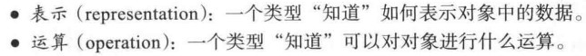
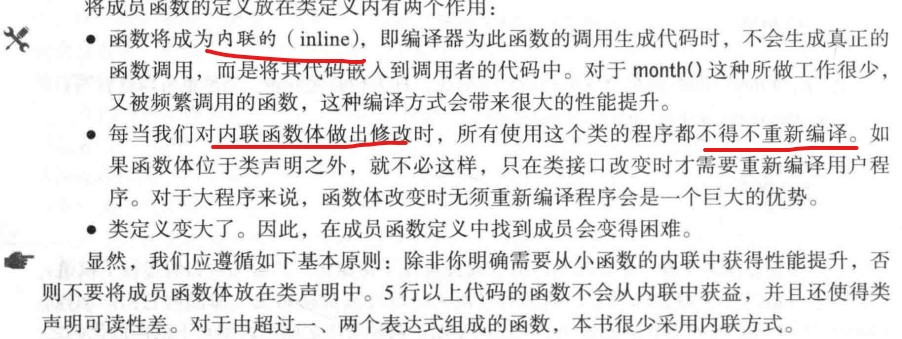
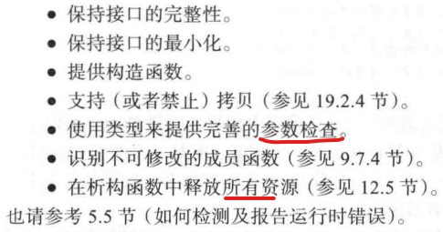
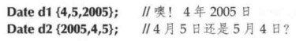

# CH09 类相关的技术细节 P222

## 9.1 用户自定义类型
- 内置类型，编译器无须借助程序员在源码中提供的任何声明。
 
- C++提供两类用户自定义数据类型：类和枚举

## 9.2 类和成员
- 类成员的访问使用object.member;类内不需要，暗含的有this

## 9.3 接口和实现
- 公有和私有

## 9.4 演化一个类
- 我们如何表示？

### 9.4.1 结构和函数
- 每当定义一个类型，我们都会需要一些针对该类型的对象的操作。

### 9.4.2 成员函数和构造函数
- 略，看书，比较熟悉，就不记录了。
 

## 9.5 枚举类型
- 很多情况下，如果程序员明确坚持做一些可能很蠢的事情，C++不会设法阻止。
- 注意，我们无法给枚举类型定义一个**构造函数**来检查初始值，但是编写一个简单的函数还是很容易的。
- 原则上，枚举类型可以用于任何需要一组相关的命名整型常量的地方。

### 9.5.1 平坦枚举
- 使用enum class定义的枚举也被称为**“作用域枚举”**，其实还有**平坦枚举**。平坦枚举将它的枚举量都隐式导出到枚举类型所在的作用域里，并且可以隐式转换到int型。
- 我们更倾向于使用简单的，更安全的作用域枚举类型，少用平坦枚举类型。C++11新出现的功能。

## 9.6 运算符重载
- 原则上，C++允许你对自定义类型使用已有的语法，但不能拓展语法。
- **一般性原则：除非你真正确定重载运算符能大大改善代码，否则不要为你的类型定义运算符。而且，重载运算符应该保持其原有意义：这只是建议，并不是C++语言规则。按习惯使用运算符，例如+只做加法，对我们理解程序会有极大的帮助**。

## 9.7 类接口
- 原则如下：
 
- 公有成员函数越多，查找bug就越困难，调试带有公有数据的类是非常复杂的。

### 9.7.1 参数类型
- 9.4.3节中为Date定义构造函数时，使用了三个整型作为其参数。这会带来问题：

- 可以使用Month枚举类型。
- 如果可以选择，将错误留在编译器而不是运行期间。
- 对于给定的应用，什么是足够好的解决方案？我们通常不会奢侈到，在已经有一个足够好的方案后，还会无止境地去追求最佳方案。继续追寻下去，我们甚至可能得到一些非常复杂，但却比最初的简单方案更差的方案。**至善者善之敌**

### 9.7.2 拷贝
- 我们需要拷贝对象吗？如果需要，如何拷贝？
- 对于Date和Month，答案很简单，复制所有成员，默认情形。
- 自定义拷贝，参见13.3节，删除参见19.2.4

### 9.7.3 默认构造函数
- 不需要显示提供初始化代码，就能创建对象，其实就是调用的默认构造函数。
- 此处有个注意点，就是**使用常量来初始化，避免使用全局变量带来的初始化**。使用default_date函数来实现Date的默认构造函数

### 9.7.4 const成员函数
- 在一个成员函数声明中，我们将const放置参数列表右边，就表示这个成员函数可以在一个常量对象上调用。一旦将一个成员函数声明为const，编译器会帮助我们保证这个成员函数不会修改对象。

### 9.7.5 类成员和辅助函数
- 如果一个函数可以简单，优美，高效地实现为一个独立函数时，就应该将它地实现放在类外部。
- **辅助函数**还被称为便利函数，帮助函数。如==，！=

## 9.8 Date类
- 暂时不做，着重看后边地内容。