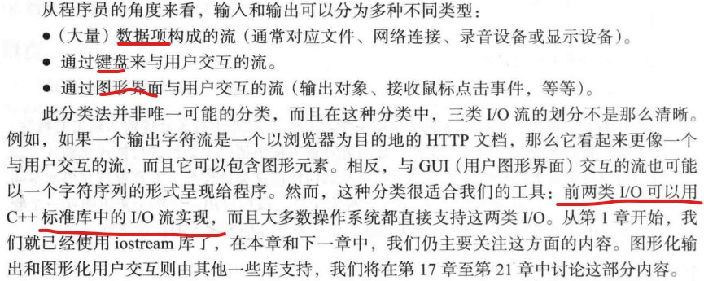

# CH10 输入输出流 P250

## 10.1 输入和输出
- 大多数现代操作系统都将I/O设备放在设备驱动程序中。通过I/O库访问设备驱动程序，这使得不同设备源的输入输出尽可能地相似。

- 输入和输出分类：

## 10.2 I/O流模型
- ostream：

-  istream：

- 输出的一个主要目的就是生成可供人们阅读的数据形式。我们将在11.2节介绍格式化输入输出。

## 10.3 文件
 

## 10.4 打开文件
- 当一个文件流离开其作用域，与之关联的文件就会被关闭。当文件被关闭时，与之关联的缓冲区就会被刷新，也就是说缓冲区的字符会被写入到文件中。
- 一般来说，**最好在程序中一开始的位置，在任何重要的计算都尚未开始之前就打开文件**。毕竟，如果我们在完成计算后才发现无法保存结果，将会是对计算资源巨大浪费。
- 在打开一个文件后，**一定不要忘记检测流对象是否成功关联了**。

## 10.5 读写文件
- 写文件通常比读文件更简单。注意，一旦一个流对象已经被初始化，我们就可以不必了解它到底是那种类型的流。如上一节ofstream，我们可以像ostream一样使用它。

## 10.6 I/O错误
- 发生输入错误的可能情况是无限的。istream将所有可能的情况归结为四类
 
- fail和bad之间的区别并未准确定义。基本思想很简单，如果输入操作遇到一个简单的格式错误，则使流进入fail状态，也就是假定我们可以从错误中恢复。另一方面，如果错误真的非常严重，例如磁盘读故障，输入操作会进入bad状态，只能退出。
 
- 下边，假定我们要读取一个整数序列存入vector中
 
- 另一个版本
 

## 10.7 读取单个值
- 小技巧，可以将读操作和范围检查合并为一条语句。
 
- 处理错误的三种可选应对方式。难在在一和二之间的取舍。
 

### 10.7.1 将程序分解为易管理的子模块
- 先看一段代码
 
- 将单独的功能分解成一个个独立的函数。
- skip_to_int，有范围的get_int利用普通的get_int不断读入整数
- 详细内容，看代码，很精彩

### 10.7.2 将人机对话从函数中分离出来
- get_int仍然混合着读取输入的代码和输出提示信息的代码。
- 实现固定格式的自定义信息。

## 10.8 用户自定义输出运算符
- 需要注意operator<<()是如何接受一个ostream&作为第一个参数，又将其作为返回值返回的。
 

## 10.9 用户自定义输入运算符
- 关键在于错误处理，这可能是很棘手的问题。
- 格式错误，返回。一般来说，指望退回这么多字符是不可行的。

## 10.10 一个标准的输入循环
- 特别是，在读入很多文件的情况下，重复检测终结符是很烦人的。可以定义一个函数来进行处理：
 

## 10.11 读取结构化的文件
- 如果格式非常乱，或文件包含太多错误，我们可以编写一个格式转换程序，将文件转换为更适合我们程序的格式。

### 10.11.1 在内存中的表示
- 常量魔数最好用符号常量替换。
 

### 10.11.2 读取结构化的值
- 见代码

### 10.11.3 改变表示方法
- 实现string到int的映射，可以使用map