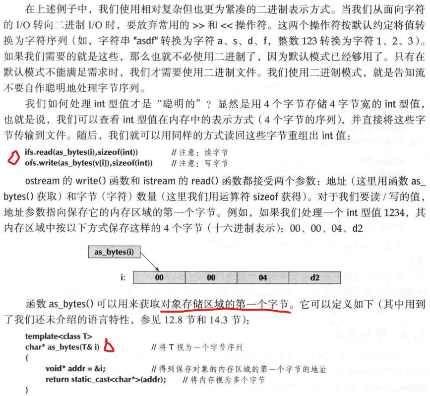

# CH11 定制输入输出 P274

- 第10章，用通用的iostream框架来解决特定的输入输出需求和偏好。其中涉及大量较为困难的细节，一方面是由人类对输入内容的敏感性决定，另一方面是由文件使用上的实际限制决定的。

## 11.1 有规律的与无规律的输入和输出
- 文本是指任何可以表示为字符序列的数据。

## 11.2 格式化输出
- 作为程序员，我们的目标是令输出尽可能地清晰和接近程序客户的期望。ostream提供许多方法格式化内置类型的输出。对于自定义类型，可自定义输出。

### 11.2.1 输出整数
 
- <<hex(16), <<oct(8), <<dec(10)都是持久的。这些关键字称为**操纵符**。
 
- 上边的操控符都是持久的

### 11.2.2 输入整数
- 默认十进制，但是可以指定十六进制或八进制
 

### 11.2.3 输出浮点数
  

### 11.2.4 精度
  
- defaultfloat默认精度是6（数字个数），可通过setprecision函数修改

### 11.2.5 域
- setw精确指定一个整数或一个字符串输出占用多少个位置。如果给的精度小于数字位数，ostream不会改变输出的值。
- 注意，域的宽度**不是持久**的。

## 11.3 打开和定位文件

### 11.3.1 文件打开模式
- **重要**

- 简单使用

- 读模式打开文件，失败原因最常见的就是文件不存在。而写模式，如果文件不存在，通常操作系统会自动创建一个新文件。

### 11.3.2 二进制文件
- **默认情况**下，iostream使用字符表示方式。即，istream从文件读取字符序列，并将其转换为所需类型的对象。而ostream将指定类型转换为字符序列，然后写入文件。**但是**，我们可以令istream和ostream将对象在内存中对应的字节序列简单地复制到文件。这称为二进制I/O。
- 此部分建议结合课本看。P281

### 11.3.3 在文件中定位
- 只要可能，**请尽量使用从头到尾的文件读写方式**。这是最简单，也不容易出错的方式。
- seekg（读）和seekp（写）操作。**特别注意**，如果你试图定位到文件尾之后，结果如何是未定义的。

## 11.4 字符串流
- 从一个字符串读取内容的istream对象称为istringstream，保存字符并将其写入字符串的ostream对象称为ostringstream。
- stringstream通常用于将真实I/O和数据处理分离。例如：

- 函数**ss.str(s)**注意下

## 11.5 面向行的输入
- getline，

## 11.6 字符分类

- 注意，小写更推荐。因为某些自然语言，并不是所有小写字母都有对应的大写字母的

## 11.7 使用非标准分隔符
- 如，一个带有**标点符号**的句子，如何得到每个单词？
- 将标点符号替换为空格。但是，代码混乱而且是专用的而非通用的。
- 下边提出一种更为通用，更为有效的从输入流中删除不需要字符的方法。
- Punct_stream实现自定义空白符，流大小写敏感，参看代码，唯一的难点就是输入运算符的实现。用istream读，istringstream临时保存结果。

## 11.8 更多未讨论内容
- 请搜索locale（本地化），这个术语通常用于描述处理自然语言差异的程序设计语言特性。
- 另一个复杂性之源是**缓冲机制**。iostream依赖于一个称为streambuf的机制。