# CH12 向量和自由空间 P296

## 12.1 简介
- 标准库vector是一种方便，灵活，（时空）高效，静态类型安全的元素容器。硬件能直接支持的只有字节序列。在最底层，计算机并不知道push_back这样复杂操作的任何信息，它所知道的只是如何**一次读或写若干字节**。
- 本章和接下来两章，我们将展示如何通过每个程序员都能使用的基本语言特性来构建vector。通过这些，我们阐明有用的概念和编程技术。首先，构建一个非常简单的vector，然后，考察vector中哪些部分不合需求并进行相应修改。

- 从此刻开始，我们终于要直接管理内存了。我们正在学习程序设计，因此必须深入程序设计的细节（底层内存访问和管理特性视为实现细节）。**指针是一种直接引用对象的底层方法**。
- 如果你对一个程序如何映射到计算机内存和操作缺乏基本的实践认识，将会在把握更高级的主题如数据结构，算法和操作系统时遇到问题。

## 12.2 vector的基本知识
- 一种可以保存地址的数据结构类型称为指针。**当需要更大空间时，可以令指针指向这一组元素**。**指针**概念及紧密相关的**数组**概念，是C++**内存**概念的关键部分。

## 12.3 内存，地址和指针
- 计算机的内存是一个**字节序列**。将这种指明内存中位置的数字称为**地址**。保存地址的对象称为**指针**。
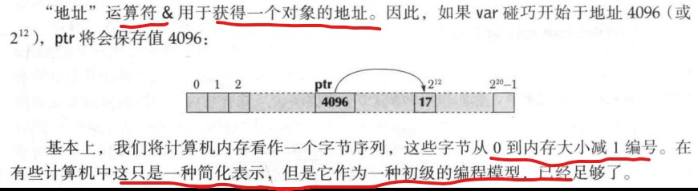
- 为什么不同类型的指针不允许赋值
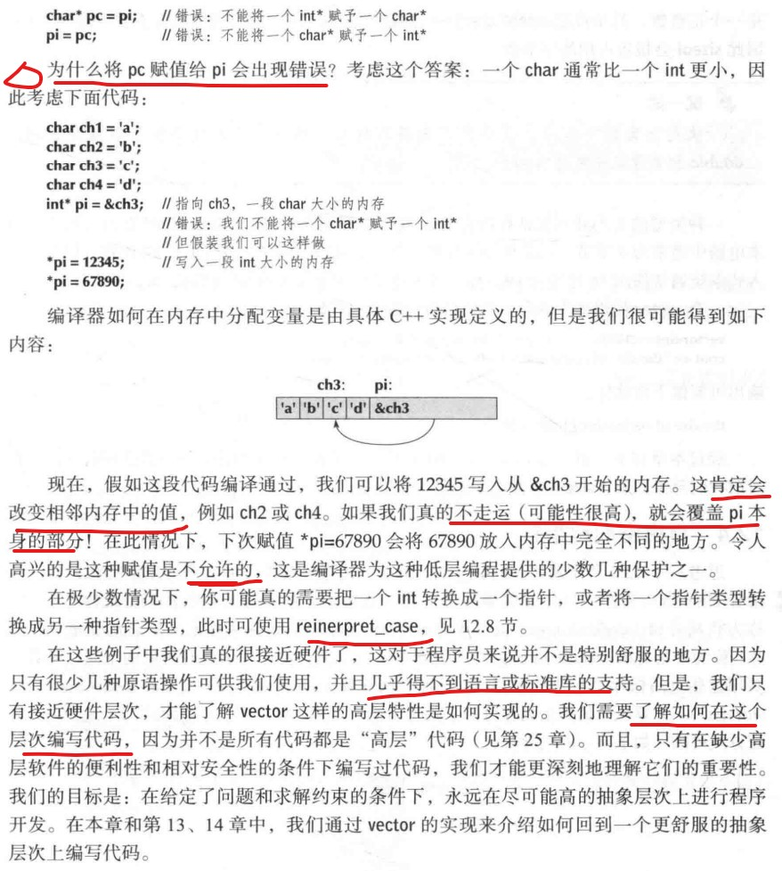

### 12.3.1 sizeof运算符
- sizeof用于一个类型名或表达式。

## 12.4 自由空间和指针
- C++程序，内存分配图
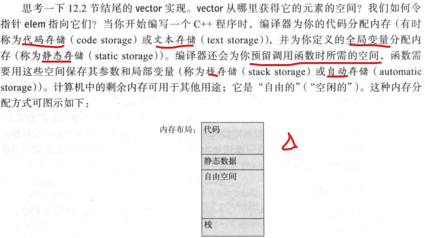

### 12.4.1 自由空间分配
- 运算符new来请求系统从**自由空间**中分配内存
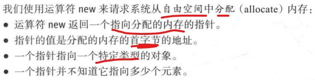
- 指向不同类型变量的指针是不同类型。
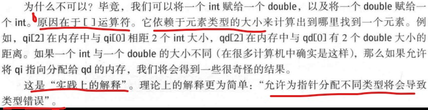
- 在侯捷老师的内存管理中有更详细的解释，因为operator new其实还是通过malloc分配内存的就是根据类型字节分配的。

### 12.4.2 通过指针访问数据
- 下标或者解引用

### 12.4.3 指针范围
- 越界错误的危害：
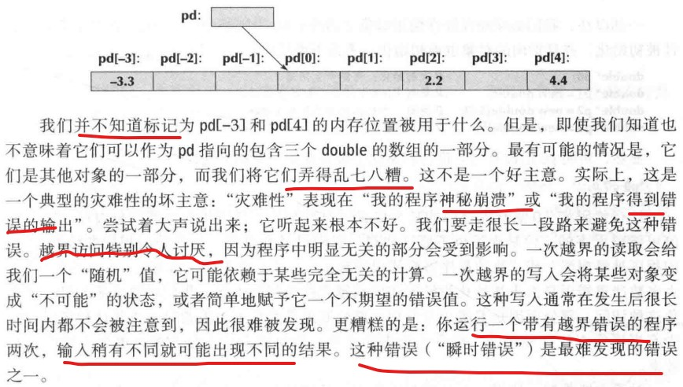
- 指针不能记住自己的大小。我们可以设计能记住大小的指针，vector差不多就是如此。

### 12.4.4 初始化
- 使用指针一定要记得先初始化
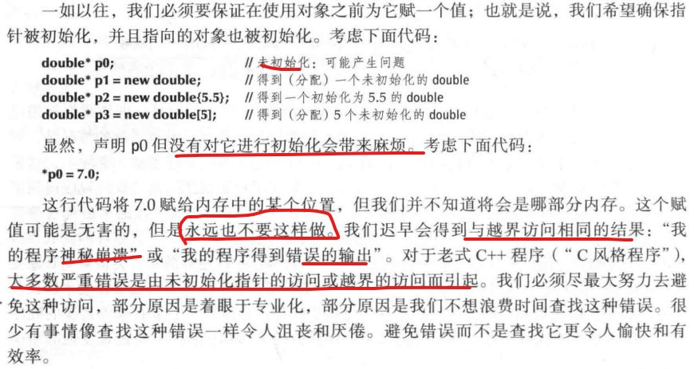
- 对new分配的对象数组，我们可以指定一个初始化列表。

### 12.4.5 空指针
- nullptr

### 12.4.6 自由空间释放
- delete运算符
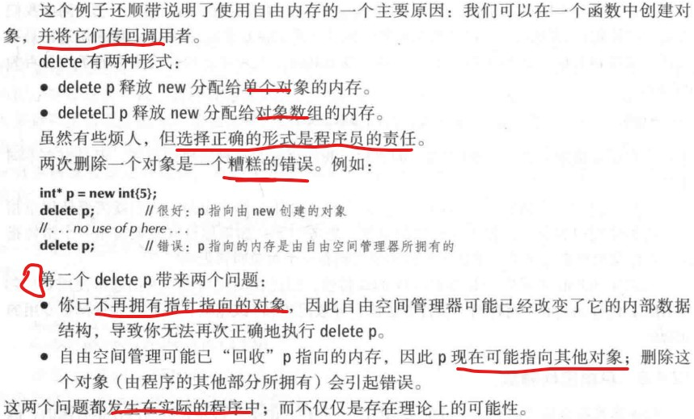
- 编译器可以在没有人工干预的情况下回收内存，这称为自动垃圾收集或垃圾收集。不幸的是，自动垃圾手机是有代价的，而且不是对所有应用都有理想的。但是，本书假设你必须处理自己的“垃圾”，我们会教你如何便捷，高效地完成这项工作。
- 注意
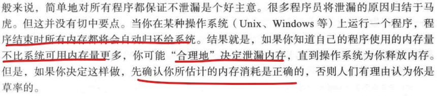

## 12.5 析构函数
- 注意在构造函数中记得为元素初始化它们的默认值。标准库vector就是这么做的。
- 析构函数确保一个对象销毁前被正确清理。
- 析构函数对于文件，线程，锁等有很好的管理机制。回忆iostream如何在使用完毕后进行清理工作的？它们刷新缓冲区，关闭文件，释放缓冲区空间等，这些都是它们的析构函数完成的。

### 12.5.1 生成的析构函数
- 有时编译器会生成默认的析构函数。成员和基类的析构函数被派生类的析构函数隐式调用。

### 12.5.2 析构函数和自由空间
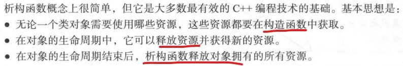
- 注意，基类的virtual析构函数
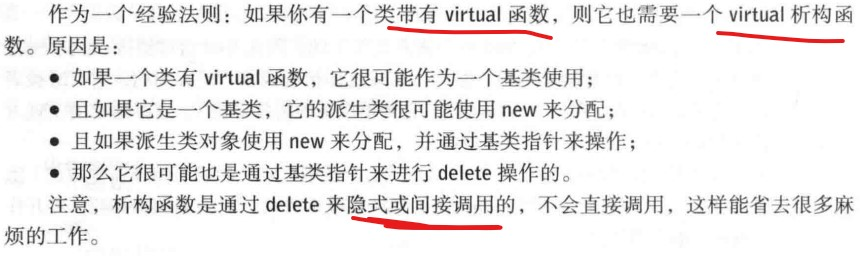

## 12.6 访问元素
- 最简单的get和set

## 12.7 指向类对象的指针
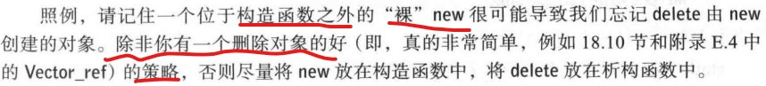 
- 如果仅仅给定一个指针，我们如何访问一个vector的成员？注意，所有类都支持对给定的对象名通过点“.”运算符来访问其成员。类似，所有类都支持对给定的对象指针通过“->”箭头运算符来访问其成员。

## 12.8 类型混用：void\*和类型转换
- 在**使用指针和自由空间分配的数组**，我们非常接近硬件层面。基本上，我们对指针的操作（初始化，分配，\*和[]）直接映射为**机器指令**。
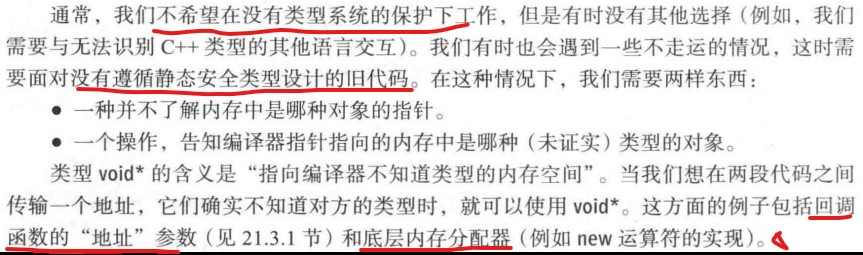 
- static_cast是故意为一个丑陋的（且危险的）操作起的一个丑陋的名字，你只应在**绝对必要**时才能使用它。你经常会发现其实没有必要使用。
- 另外两种 更具危险性的操作
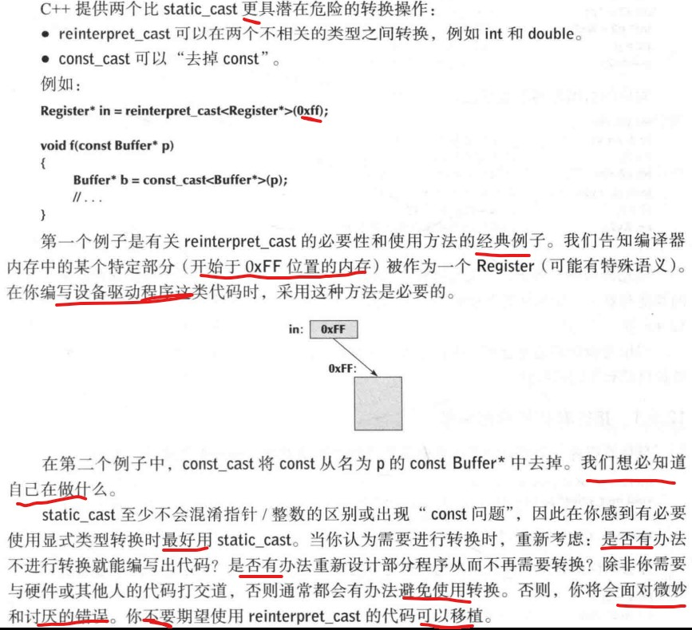 

## 12.9 指针和引用
- 指针和引用的区别：注意避免空指针
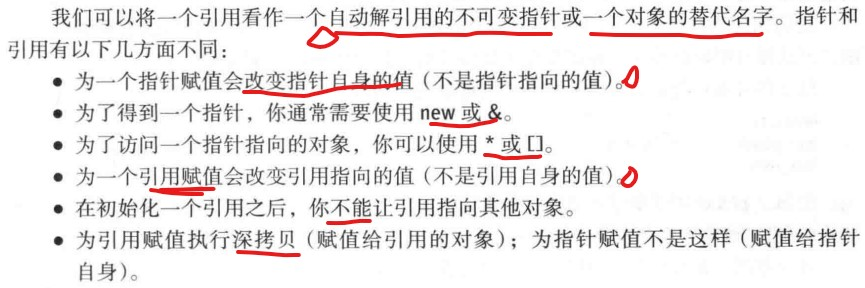 
- 引用与指针都是通过使用内存地址来实现的。它们只是在地址的使用上不同。

### 12.9.1 指针参数和引用参数
- 两种参数的选择：
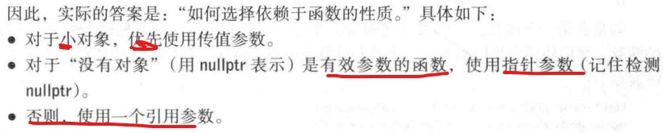 

### 12.9.2 指针，引用和继承
- 多态
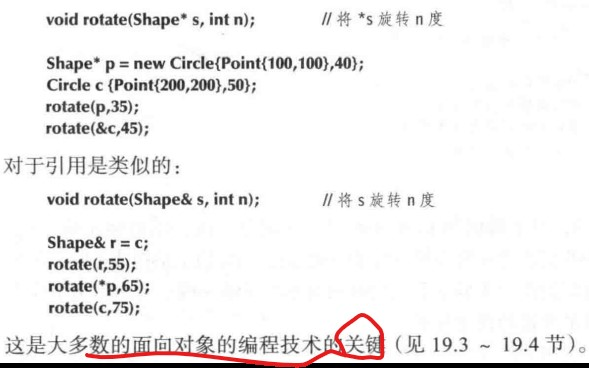 

### 12.9.3 实例：链表
- **一定要注意空指针**。

### 12.9.4 链表操作
- 标准库list隐藏了所有链接操作。我们实现一个自定义的List，操作包含构造函数，insert，add，erase，find，advance。

### 12.9.5 链表的使用
- 两个不同的链表，把其中一个链表的节点插入到另一个链表时，**要注意头节点**的情况。

## 12.10 this指针
- 上边的操作函数第一个参数都是Liink\*，我们可以实现为成员函数。
- this是指向当前成员函数的对象。
- 通过观察发现，我们仍没有一个链表类，只有一个链接类。这样我们就**必须一直为哪个指针指向第一个元素而操心**。此处，好好体会标准库list的实现。