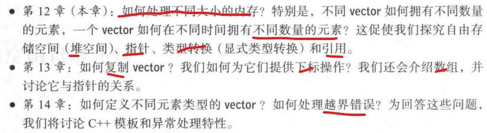

# CH12 向量和自由空间 P296

## 12.1 简介
- 标准库vector是一种方便，灵活，（时空）高效，静态类型安全的元素容器。硬件能直接支持的只有字节序列。在最底层，计算机并不知道push_back这样复杂操作的任何信息，它所知道的只是如何**一次读或写若干字节**。
- 本章和接下来两章，我们将展示如何通过每个程序员都能使用的基本语言特性来构建vector。通过这些，我们阐明有用的概念和编程技术。首先，构建一个非常简单的vector，然后，考察vector中哪些部分不合需求并进行相应修改。

- 从此刻开始，我们终于要直接管理内存了。我们正在学习程序设计，因此必须深入程序设计的细节。指针是一种直接引用对象的底层方法。

## 12.2 vector的基本知识
- P297
