# CH13 向量和数组 P326

- 本章内容概要：
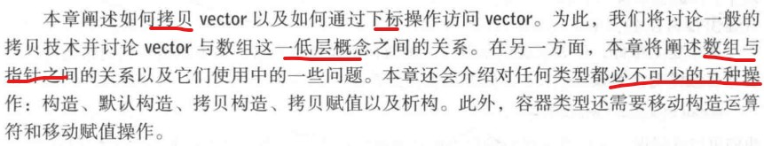

## 13.1 简介
- 裸机访问有关的基本限制：
	- 一个对象在内存中的大小是固定的
	- 一个对象存放在内存中的某一特定位置
	- 计算机只为这些对象提供了有限的 基本操作。
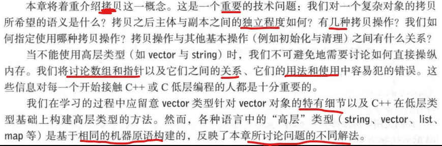

## 13.2 初始化
- 使用initializer_list初始化
- 注意小括号和大括号的区别
- 注意我们是按传值方式传递initializer_list的，我们故意这样做的，这也是**语言规则要求**的：一个initializer_list只是分配在”别处的“元素的句柄。  不理解。C++ primer P198. visual C++拷贝是使用的默认拷贝，而其成员是两个const T*。

## 13.3 拷贝
- 默认拷贝是浅拷贝。两者共享同一个存储地方。但是类内涉及到指针一般都需要深拷贝，否则可能会释放两次同一块内存。

### 13.3.1 拷贝构造函数

- 注意参数，是const引用。
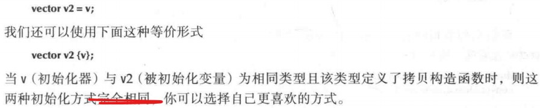

### 13.3.2 拷贝赋值
- 默认的可能会出现默认拷贝一样的问题。注意一般先分配内存在拷贝最后再释放旧空间再赋值。

### 13.3.3 拷贝术语
- 浅拷贝和深拷贝
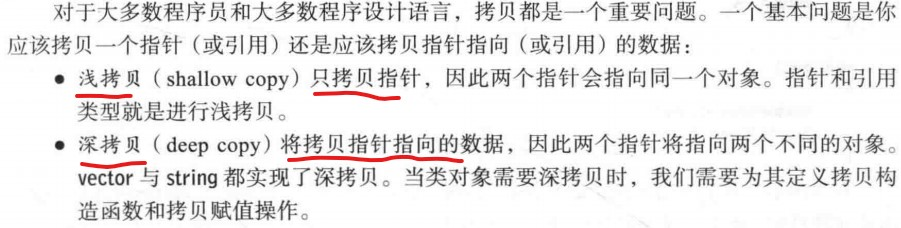
- 注意下，指针或引用语义和值语义，容易混淆
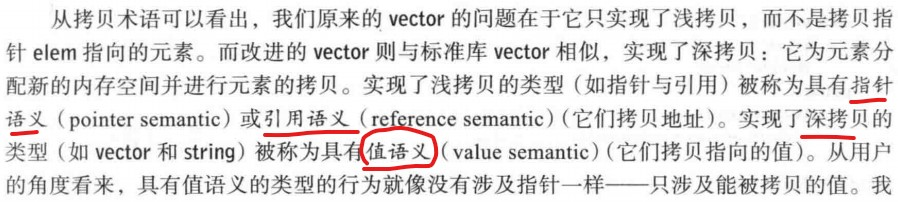

### 13.3.4 移动
- 注意移动操作**不能**接受const参数。移动操作的目的之一是修改源对象。
- 移动构造函数**隐式地**用于实现函数返回。编译器知道要返回地局部值将要离开其作用域，因此可以将其值移出而非拷贝它。

## 13.4 必要的操作
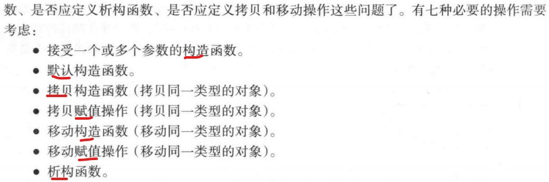 
- 何时需要默认构造函数？
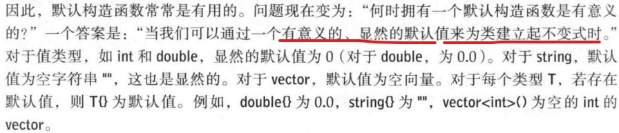 
- 如果一个类需要获取资源（从某处获取，使用完毕后必须归还的东西），则它需要析构函数。如，自由空间获取内存，锁，线程句柄以及套接字等。
- 一个类需要析构函数的另一个简单标志是它包含指针成员或引用成员。一个需要析构函数的类几乎肯定需要一个拷贝构造和拷贝赋值操作。类似的，一个需要析构函数的类几乎肯定需要一个移动构造和移动赋值操作。

### 13.4.1 显示构造函数
- 谨慎使用隐式转换，可能造成不可预料的后果。
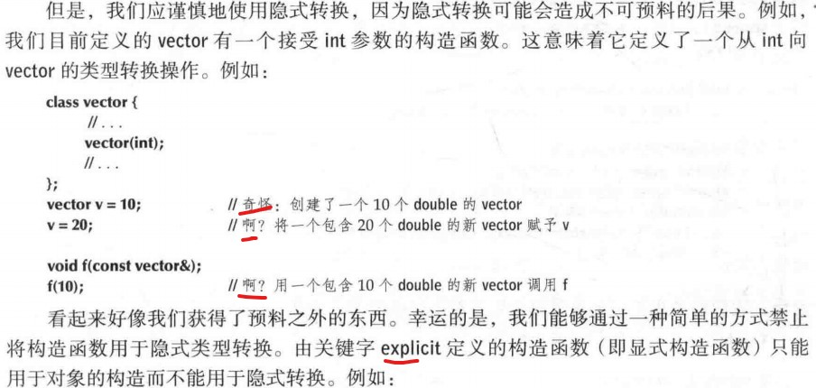  
- 构造函数默认不是explicit的，当我们拿不定主意时，应将所有单参数的构造函数定义为explicit。

### 13.4.2 调试构造函数和析构函数
- 你可以通过观察构造函数的调用次数与析构函数的调用次数是否相等来判断程序中是否存在内存泄漏问题。如果程序规模太大，就需要专业的工具（泄漏探测器）。当然，最理想的情况是使用一些避免内存泄漏的技术来防止内存泄漏。

## 13.5 访问vector元素
- 重载下标运算符

## 13.5.1 对const向量重载运算符
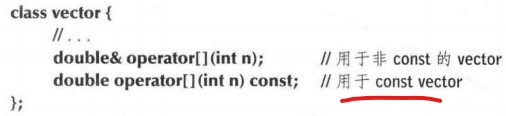   

## 13.6 数组
- 数组通常可定义为：
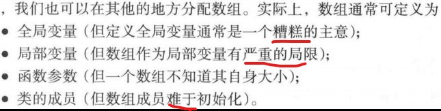   
- 数组就是内存中**连续存储**的同构对象序列。切记，不能越界访问。

### 13.6.1 指向数组元素的指针
- 进行指针运算时必须十分小心，确保结果不超出数组的范围。**不幸的是**，由指针运算所造成的错误有时很难被发现。通常最好的策略是尽量避免使用指针运算。

### 13.6.2 指针和数组
- 数组的名字代表了**数组的所有元素**。然而，数组的名字可以转化（退化）为指针。
- 加那个数组名转化为指针的一个原因是避免意外地以传值方式传递大量数据。
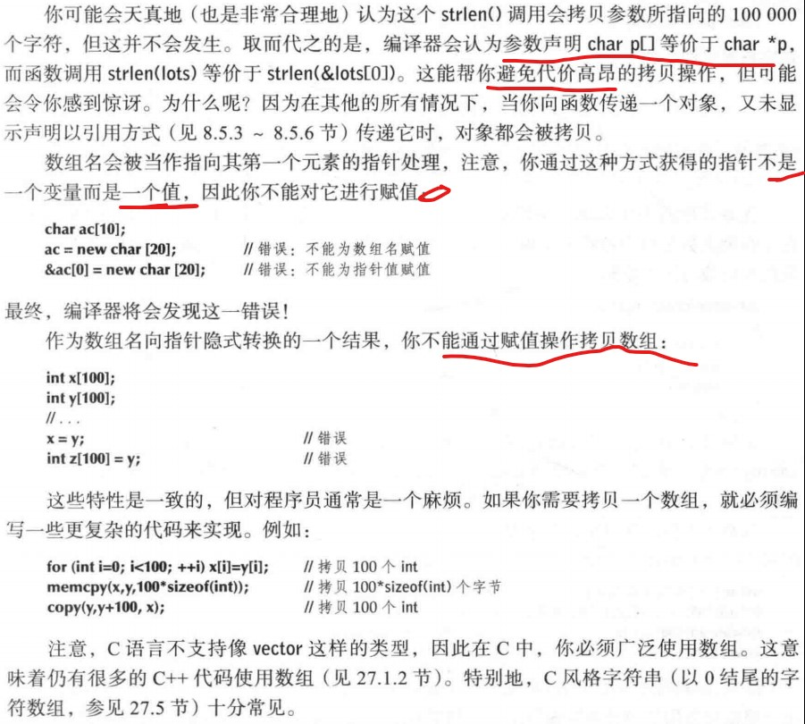   

### 13.6.3 数组初始化
- 略

### 13.6.4 指针问题
- 考虑以下的指针问题
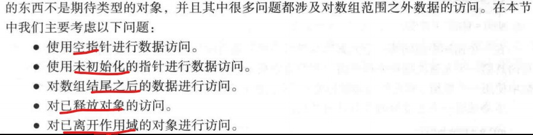   
- 建议不要向函数传递空指针，如果不得不这么做，应在使用之前检测空指针。
- 使用引用代替指针和使用异常来报告错误是避免空指针的主要工具。
- 不要访问不存在的数组元素
- 不要通过一个已清除的指针访问数据
- 不要返回指向局部变量的指针
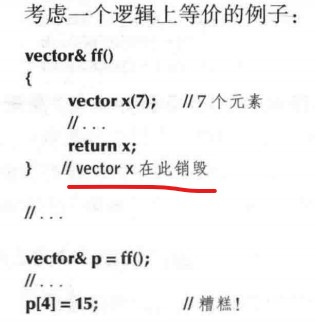   
- 不要低估这些问题。很多有经验的程序员都曾被这些简单的数组和指针问题的无数变形和组合打败。我们应该使用vector，RAII以及其他系统化方法来管理内存与其他资源。

## 13.7 实例：回文
- 将采用不同的实现方法，以观察不同的语言特性是如何影响代码的形式和工作方式的。
- 思路都是头尾一次向里比较

### 13.7.1 使用string实现回文
### 13.7.2 使用数组实现回文
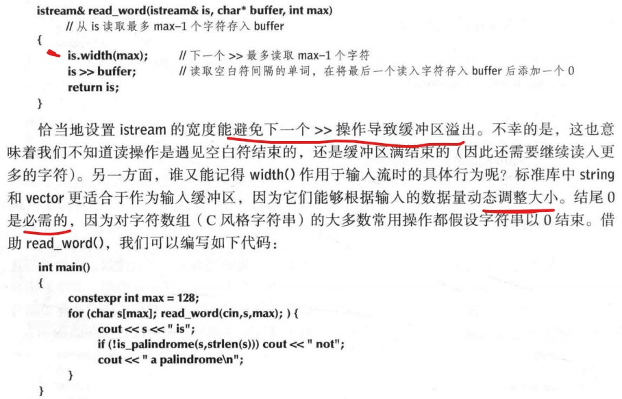 
- 注意is.width(max)可以设置读取最多max-1个字符。
- 数组方式比string方法复杂的多，并且如果处理长字符串时，情况会变得更糟。

### 13.7.3 使用指针实现回文
- 判断的时候可以用下递归（皮一下）。