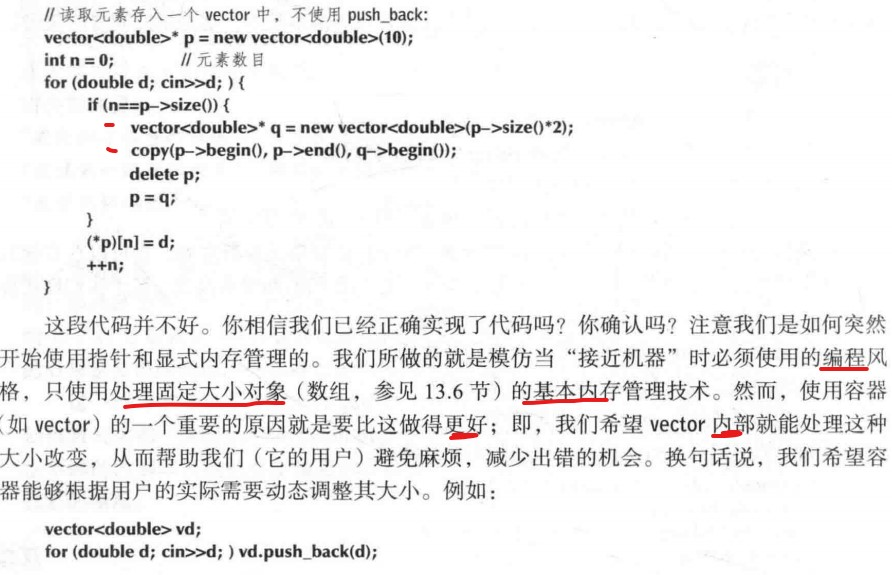

# CH14 向量，模板和异常 P354

- 本章内容概要：

## 14.1 问题

- vector，可以改变它的两方面属性：元素的数量和类型。

- 实际上，我们用来保存和访问数据的技术对所有重要计算模型来说都是最为基础也最为常用的技术。**在内存管理的最底层，所有的对象都是固定大小而且不存在类型的概念**。

## 14.2 改变大小
- 本章只考虑实现resize，push_back和赋值来改变自身大小。

### 14.2.1 表示方式
 
- 实际上vector就是这样实现的。尾后元素完全是想象中的。**默认构造函数不在空闲空间中分配内存**，只占用最小的存储空间（看习题16）。

### 14.2.2 reserve和capacity
- reserve可以增加内存空间，如果参数小于等于当前空间什么也不做。注意，我们并没有对预留空间中的元素进行初始化。毕竟，我们只是预留空间以备将来被push_back和resize使用。

### 14.2.3 resize
  
- 感觉有重复初始化的浪费。

### 14.2.4 push_back
- 如果没有空间，我们将分配的空间大小加倍。实践已证明这种内存空间的扩张策略对于绝大多数vector应用都是一个好的选择，且这种策略已被用于大多数标准库vector的实现。

### 14.2.5 赋值
- 最简单的实现包括如下操作：
	- 为副本分配存储空间
	- 拷贝元素
	- 释放原有已分配的空间
	- 将sz，elem，space设置为新值 
	- 改进，如果被赋值的vector大小大于赋值对象，直接复制。
	- 当然，别忘了自我赋值。

### 14.2.6 到目前为止的vector类
  
  
- 构造函数中的sz感觉应该为0

## 14.3 模板
- 模板是一种机制，它令程序员能够使用类型作为类或函数的参数。当我们提供具体类型作为参数时，编译器会为之生成特定的类或函数。

### 14.3.1 类型作为模板参数
 
 

### 14.3.2 泛型编程
  
- 泛型编程：由模板支撑，依赖编译时解析
- 面向对象编程：由类层次和虚函数支撑，依赖运行时解析。
 

### 14.3.3 概念（陌生）
- 模板由极大的灵活性和接近最优的性能。但模板的”内在“（定义）与其接口（声明）不能很好地分离。错误信息相当糟糕，而且错误信息在编译过程中的出现时间远远落后与我们的期望。

### 14.3.4 容器和继承
- 继承是一种强大但微妙的机制，而模板并没有隐含地扩展它。存在几种用模板表达继承地方法，但这些内容不在本书地讨论范围。我们只需记住，对于任意模板C，**D是B并不意味着C<D>,C<B>**,并且应重视这一规则的价值，它能避免意外的类型违规。

### 14.3.5 整数作为模板参数
- 将整型值作为模板实参最常见的用途-一个容器所包含的元素数在**编译时**就已确定。

- array和vector的接口是相同的，CH15和CH16将会详细介绍这种编程风格。

### 14.3.6 模板实参推断
- 一个类模板，创建某个特定类的对象时，**需要指定**模板实参。对于函数模板，编译器通常能够根据函数实参**推断出**模板参数。

### 14.3.7 泛化vector
- 为了处理默认值的类型，我们可以设置一个用户选项，以便在我们需要一个默认值时能够指定使用什么值。

- 更多的细节，参见memory头文件。
- 此处用allocate实现reserve操作。
- 摆弄分配器属于非常高级的C++特性，我们暂时不管。

## 14.4 范围检查和异常
- vector中at操作时带范围的元素访问

### 14.4.1 旁白：设计上的考虑

### 14.4.2 坦白：使用宏
- 调试版本Vector

## 14.5 资源和异常
- 资源的例子：内存，锁，句柄，线程句柄，套接字，窗口。
- 对于vector这样负责释放一个资源的对象，我们称之为**所有者或句柄**。

### 14.5.1 潜在的资源管理问题
- 考虑下边代码：

- 可能会内存泄漏。如，我们中途更改了p的指向，或者中途执行过程中，发生异常。
- 虽然try...catch可以用于解决内存泄漏问题，但是代码中包含多个try语句块将造成代码的重复冗余。我们不喜欢**重复冗余**的代码，重复意味着代码维护代价增加，丑陋意味着代码难于修改，难于阅读。

### 14.5.2 资源获取即初始化
- 幸运的是，我们可以不必在代码中添加复杂的try和catch就能处理潜在的资源泄漏问题。

### 14.5.3 保证（重要）

- effective C++上有更详细的描述

### 14.5.4 unique_ptr
- 大多数try块可以被资源获取即初始化（RAII）技术的某种变体所替代。
- 可以使用unique_ptr（和普通指针相比没有额外开销）。如果你需要一种既确保释放内存又能拷贝的智能指针，可以使用shared_ptr

### 14.5.5 以移动方式返回结果
- make_vec最终版本，最简单也最推荐。

### 14.5.6 vector类的RAII
- vector_base处理的是内存而不是带类型的对象。我们的vector实现可以将它用于存储所需元素类型的对象。
