# CH15 容器和迭代器 P473

- 本章内容概要：
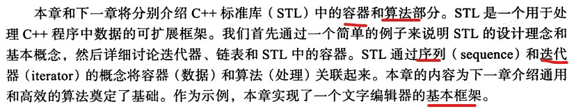

## 15.1 存储和处理数据
- 方法1：将Jack和Jill的程序结果分别写到文件中，再从文件中读入数据。这种方法与他们所用的数据结构和接口彻底无关。这种**程序之间的独立性**是一种很好的特性
- 如果不适合用文件呢 ？

### 15.1.1 处理数据
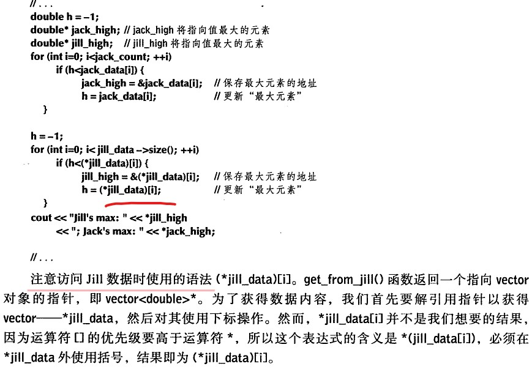 

### 15.1.2 泛化代码
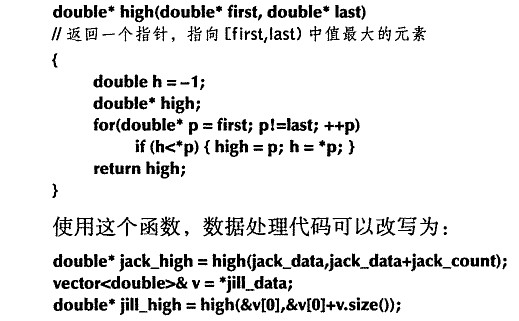  
- 考虑这段程序，潜在的严重错误。
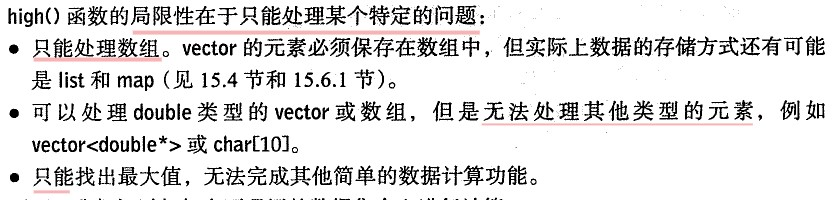 
- 但是，其也有优势，可以找局部的最大值。
- 记住，**代码泛化可以获得适用于多个问题的通用函数**。

## 15.2 STL理念
- 处理数据序列的一个专门的框架。STL提供容器和算法。
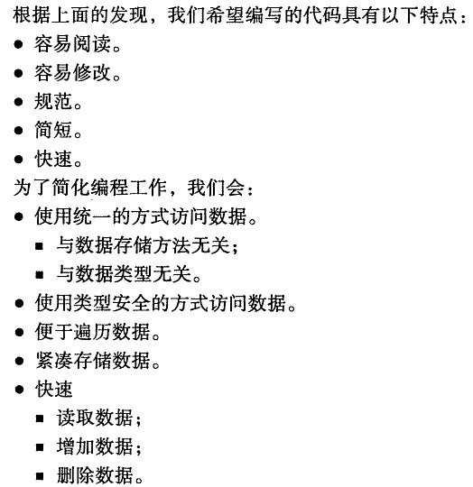 

## 15.3 序列和迭代器
- 左闭右开，迭代器不仅仅是指针，比如可以定义一个边界检查的迭代器。
- 迭代器是一个抽象的概念，对数据的访问可以使用迭代器。

### 15.3.1 回到实例
- “魔数”是一种偷懒的表现。
- 有Iter来代替指针，实现前边的high函数。

## 15.4 链表
- 写出双链表的结构。

### 15.4.1 链表操作
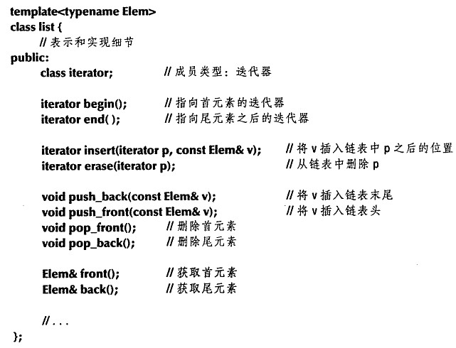  
- list可以实现下标操作，但是极为缓慢。我们将迭代器作为list的嵌套类，没有理由将迭代器类型实现为全局类，因为这一迭代器只有list使用。

### 15.4.2 遍历
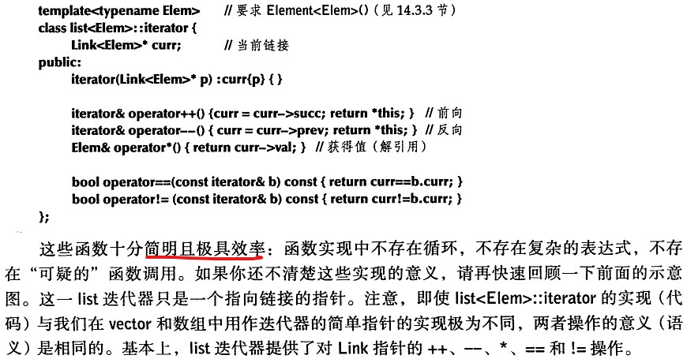   
- 迭代器之所以设计成左闭右开，深层次原因就是  空的情况不在特殊。
- 链表的实现细节，参考习题12-14.

## 15.5 再次泛化vector
- CH14章，我们并没有给vector的迭代器部分。
- 通过别名，我们事实上不需要知道iterator的具体类型。
- 容器C的迭代器类型可以用C::iterator，也可以用Iterator<C>，后者更推荐。后者通过一个简单的模板别名就可以实现。

### 15.5.1 遍历容器
- 使用begin和end来遍历。fanweifor其实不过是使用迭代器遍历序列的一种“语法糖衣”而已。

### 15.5.2 auto
- 在写迭代器类型，lambda，或者你不知道但是编译器知道（模板）特别有用。

## 15.6 实例：一个简单的文本编辑器
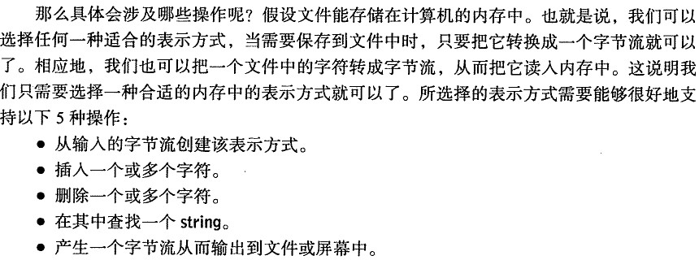
- 分析，为什么使用了list而不是vector
	-  可能会有频繁的在中间插入
	-  可能插入某行

### 15.6.1 处理行
- 如何判断行？
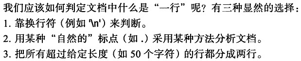
- 此处选择第一种方法。
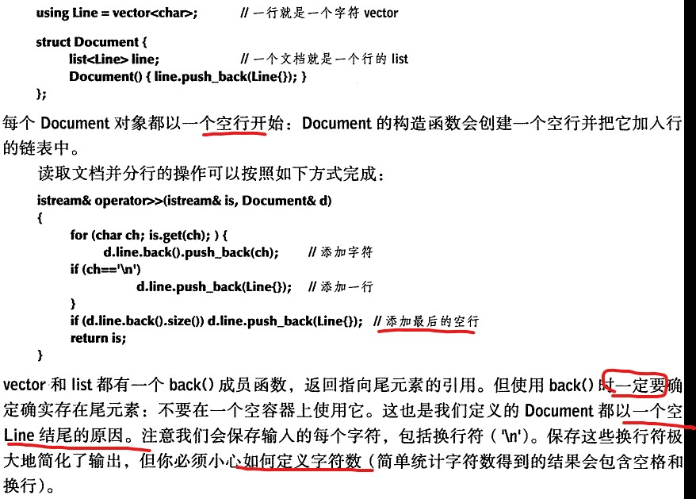

### 15.6.2 遍历
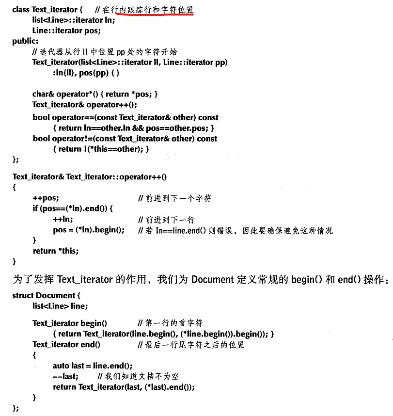
- 现在，我们就可以使用范围for来遍历文档了。
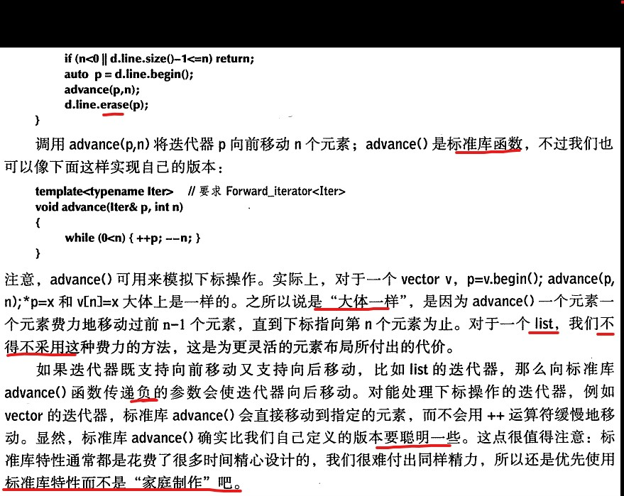
- 优先考虑使用标准库的操作。
- 如何查找某个单词？
	- 此处给出简单的算法，通过find找第一个字符相同的，如果相同则看其他的是否相同。 

- 我们的“文本处理器”非常简单。我们的目的是简洁高效，而不是提供一个特性丰富的编辑器。此处只是来展示序列，迭代器和容器等STL概念结合某些STL规范。

## 15.7 vector，list和string
- 在考虑性能之前，我们先来看看这些存储方式的逻辑特性：有什么是它能做而其他方式所不能的？
	- 原生数组；不能知道自己大小，没有任何容器成员函数，不能检测边界。数组大小 在编译期间确定，比较操作使用的是指向数组第一个元素的指针。
	- vector，基本可以做所有事。但是请避免移动字符。
	- string提供所有常见的有用操作。
	- list，每个元素需要两个额外的字（保存指针），插入或删除不必移动其他元素。

### 15.7.1 insert和erase
- 如果对于一个vector执行列表操作，一定不要保留指向其元素的迭代器或指针。这也正是list相对于vector的**根本优势**。但是list与其他三种容器相比需要至少3倍的存储空间。
- 下边的例子看书。

## 15.8 调整vector类达到STL版本的功能
- erase和insert实现
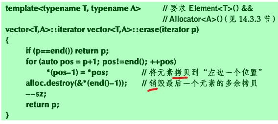
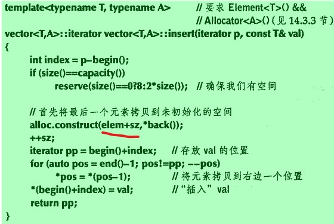
- 迭代器**不能**指向序列之外，所以我们使用指针来完成。
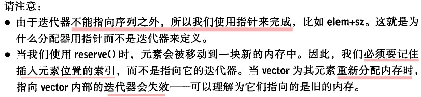
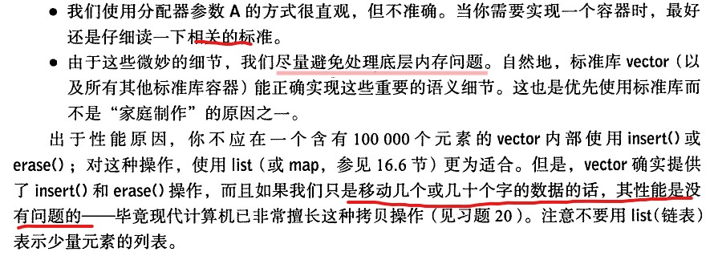

## 15.9 调整内置数组达到STL版本的功能
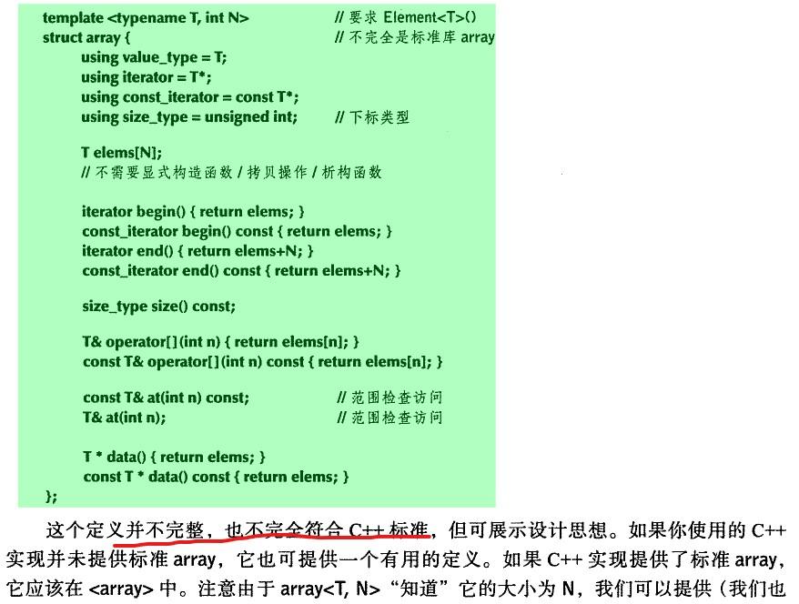

## 15.10 容器概览
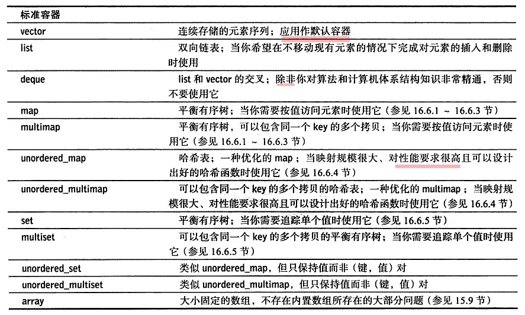